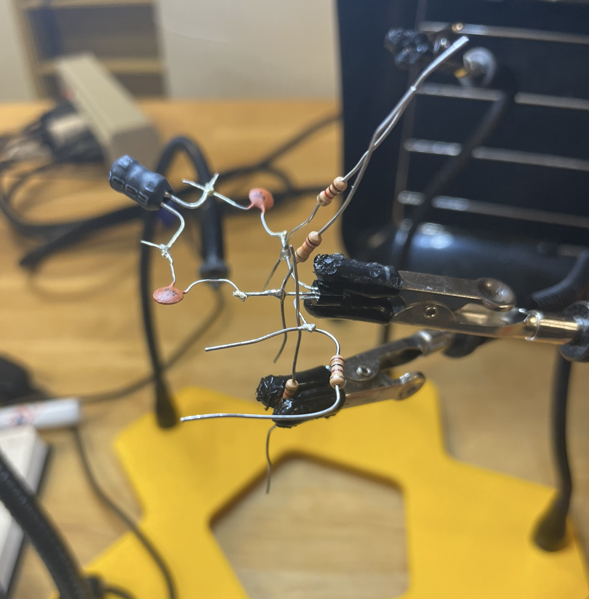

# Colpitts Oscillator Circuit

In this projoct I designed and built a single transistor oscillator circuit. The project was built using the deadbug contruction technique. This technique and much of the work for this project was done with the help of the W7ZOI book RF Experimental Methods. 

The goal was to make an oscillator that could drive a 50 Ohm load with an oscillation frequency of at least 5 MHz. The project was done using discrete components soldered together on top of a copper ground plane.

