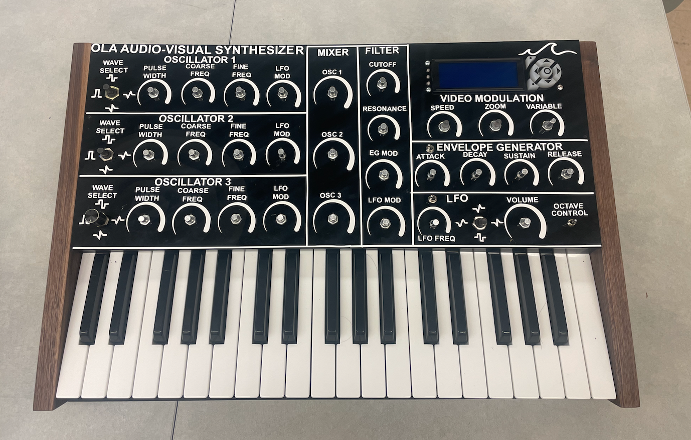
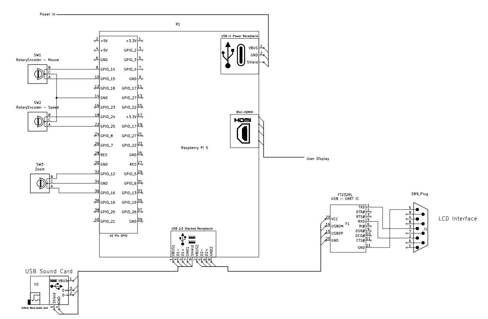
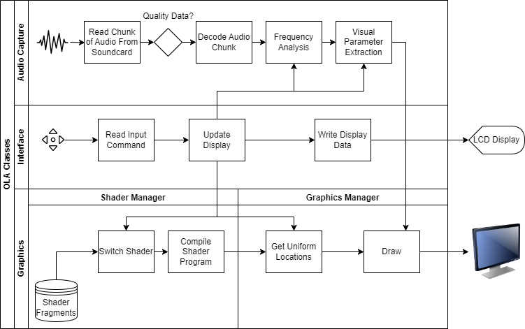
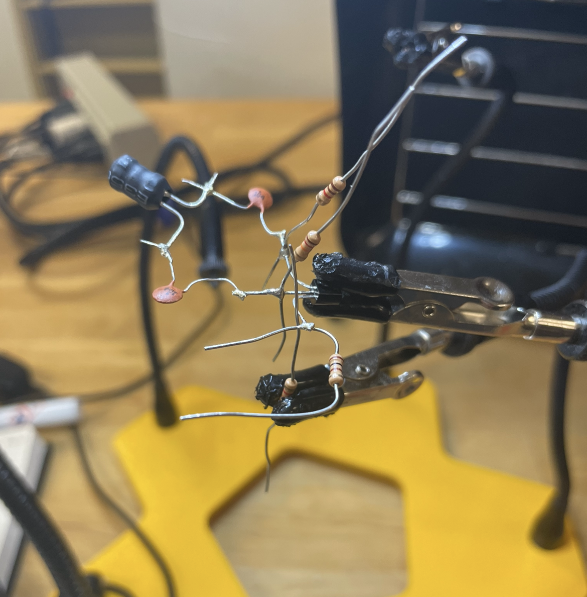
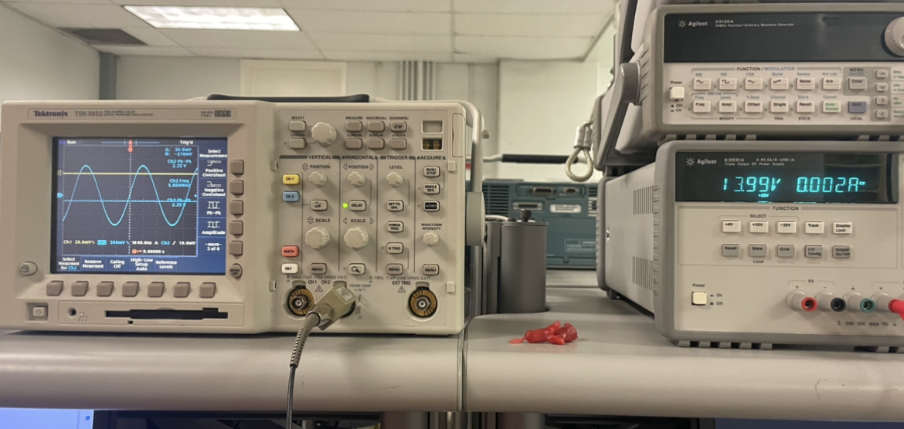

# Audio Visual Synthesizer - ola

This project was focused on creating a standalone, non-modular audiovisual synthesizer. The goal was to create an all-in-one device that integrated a analog audio synthesis system with an embedded system with an SoC that could output a video signal that tracked the input audio in real time. 
Ola means wave in Spanish, which we felt was a good fit for the projects initial vision of seeing the sound as you play an instrument. 

The work was split amongst five subteams: 
- Audio Synthesis System
- Power System
- Embedded Systems - Audio Control
- Embedded Systems - Video Synthesis
- Interface

I was the lead for the design and development of the Video Synthesis Embedded Subsystem.

## Embedded Video Subsystem
The video synthesis embedded subsystem is the end of the audio-visual synthesis chain.
It is responsible for taking periodic measurements of the analog audio signal generated by the
audio processing subsystems, and generating visualizations that correspond to the frequency
content of the audio input. The system also manages part of the interface, it runs an LCD
interface and three rotary encoders providing more finetune control over how the visuals are
generated. The LCD interface allows the user to adjust the base animation, and how sensitive the visual effects are to the audio input, the rotary encoders give direct access to graphical effects such as
zooming in or out of the display. 

**HARDWARE**

The hardware components are:
- Raspberry Pi 5
- 3d Sound USB Soundcard with a PCM2902 CODEC 
- Orbital Matrix LCD Display

**SOFTWARE**

The programming for the graphics is done in a mix of C++ and Python. The code handling the audio input and LCD interface is done in Python. The Raspberry Pi was used with the standard Raspian OS.

# Colpitts Oscillator Circuit

In this projoct I designed and built a single transistor oscillator circuit. The project was built using the deadbug contruction technique. This technique and much of the work for this project was done with the help of the W7ZOI book RF Experimental Methods. 

The goal was to make an oscillator that could drive a 50 Ohm load with an oscillation frequency of at least 5 MHz. The project was done using discrete components soldered together on top of a copper ground plane.

